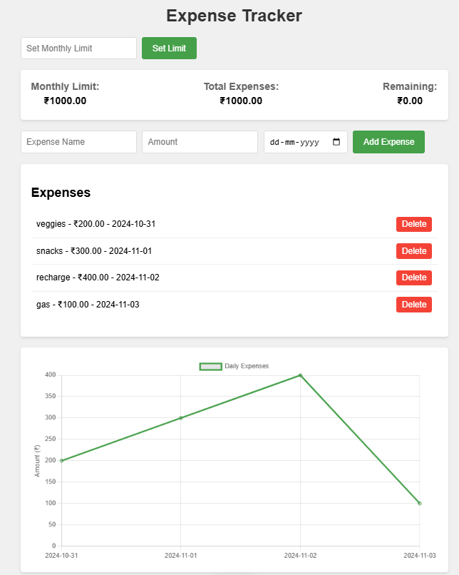

# Expense Tracker Web Application 💵

A responsive web-based expense tracking application that helps users manage their monthly expenses with visual representations and budget monitoring system.

## Features

- 📊 Set and track monthly budget limits
- 💰 Add and delete expenses with dates
- 📈 Visual representation of expenses through charts
- 🚨 Alert system for budget limit exceeded
- 📱 Responsive design for both desktop and mobile devices
- 📊 Daily expense trend visualization
- 💵 Real-time calculation of remaining budget

## Technologies Used 👨🏻‍💻

- HTML5
- CSS3
- JavaScript (Vanilla)
- Chart.js for data visualization

## Installation and Setup ⬇

1.**Clone the repository:**

2.**Navigate to the project directory:**

3.**Open the index.html File:**
Open index.html in your preferred web browser

### Browser Support 🌐
- Chrome (latest)
- Firefox (latest)
- Safari (latest)
- Edge (latest)

### Preview of webapp:

## Usage
1. Open the application in your preferred web browser.
2. Set your monthly budget limit in the "Set Monthly Limit" input field and click "Set Limit".
3. Fill in the details for each expense and click "Add Expense" to record them.
4. Monitor your current spending status in the status container.
5. Manage your expenses using the provided delete functionality.
6. Keep track of your budget with real-time alerts.

### Happy Coding!
Jivan Jamdar 🤓
