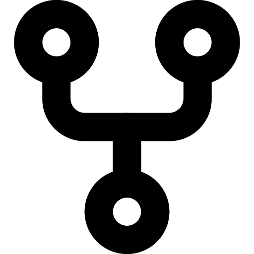
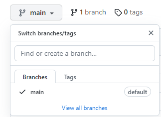

<p align="center">
  <a href="master-web-development.netlify.app">
    
  </a>
</p>
<h1 align="center">Master Web Development</h1>

<div align="center">
  Learn by building simple projects, using HTML, CSS, JS.
</div>

<br />

<div align="center">
  <!-- Standard -->
  <a href="https://standardjs.com">
    
  </a>
  
  [](https://github.com/ellerbrock/open-source-badges/)
  [](http://makeapullrequest.com)
  
  
  
  
</div>

## ⚡️  Introduction
This repository contains frontend projects that will help you to become an ace Frontend Developer.

The goal is to be well versed with HTML, CSS, JavaScript and Browser APIs such as localStorage, IndexDB, etc.

## 💯open source programs this repo has been part of
<div align="center">


</div>

## 🎯 All Projects
The list of projects are given below -
<br>
[ 01- 15 Puzzle](https://yourwebsite.com/projects/15_puzzle/)  
[ 02- 2048 ](https://masterwebdevelopment.netlify.app/projects/2048%20Game/index.html) 
<br>
[ 03- 3D Music Visualizer](https://masterwebdevelopment.netlify.app/projects/3D%20Music%20Visualizer/index.html )  
[ 04- 8 Puzzle](https://yourwebsite.com/projects/8_puzzle/)  
[ 05- Alphabet Keyboard](https://masterwebdevelopment.netlify.app/projects/Alphabet%20Keyboard/index.html)  
[ 06- Among Us](https://masterwebdevelopment.netlify.app/projects/apod/)  
[ 07- Astronomy Picture of the Day](https://masterwebdevelopment.netlify.app/projects/apod/) 
<br>
[ 08- Bill Splitter](https://masterwebdevelopment.netlify.app/projects/Bill%20Splitter/index.html) 
<br>
[ 09- BMI Calculator](https://masterwebdevelopment.netlify.app/projects/bmi%20calculator/index.html) 
<br>
[ 10- BookVerse-A Book Website](https://yourwebsite.com/projects/bookverse/)  
[ 11- Box Connect Game](https://masterwebdevelopment.netlify.app/projects/box%20connet%20game/box.html) 
<br>
[ 12- Brick Breaker](https://masterwebdevelopment.netlify.app/projects/Brick%20Breaker/index.html) 
<br>
[ 13- Bubble Hit Game](https://masterwebdevelopment.netlify.app/projects/Bubble%20Hit%20%20Game/)  
[ 14- Calculator](https://yourwebsite.com/projects/calculator/)  
[ 15- Candy Game](https://masterwebdevelopment.netlify.app/projects/Candy%20Game/index.html)  
[ 16- Chatbaot](https://masterwebdevelopment.netlify.app/projects/Christmas%20Bauble/index.html) <br>
[ 17- Christmas Bauble](https://masterwebdevelopment.netlify.app/projects/Christmas%20Bauble/index.html)  
[ 18- Coin Toss Game](https://yourwebsite.com/projects/coin_toss/)  
[ 19- Color Guessing Game](https://masterwebdevelopment.netlify.app/projects/Color%20Guessing%20Game/index.html) 
<br>
[ 20- Connect-4-Dot]( https://masterwebdevelopment.netlify.app/projects/connect4/)
<br> 
[ 21- Connect4(Two player)](https://masterwebdevelopment.netlify.app/projects/connect4/) <br>
[ 22- Counter](https://yourwebsite.com/projects/counter/) <br>
[ 23- Currency Converter](https://masterwebdevelopment.netlify.app/projects/Currency%20Convertor/index.html)  
[ 24- Cut The Rope](https://masterwebdevelopment.netlify.app/projects/Cut%20The%20Rope/index.html)  
 [ 25- Dice Game](./projects/Dice%20Game/index.html)  
[ 26- Dictionary](https://masterwebdevelopment.netlify.app/projects/dictionary/)  
[ 27- Doodle Jump](https://masterwebdevelopment.netlify.app/projects/Cut%20The%20Rope/index.html)   
[ 28- Drawing App](https://masterwebdevelopment.netlify.app/projects/Simple%20Drawing%20app/index.html)  
[ 29- Drum Kit](https://masterwebdevelopment.netlify.app/projects/drum-kit/)   
[ 30- Email Validator](https://masterwebdevelopment.netlify.app/projects/Email%20Validator/index.html)  
[ 31- Eye that follow](https://masterwebdevelopment.netlify.app/projects/eye%20that%20follow/index.html)  
[ 32- Flappy Bird](https://masterwebdevelopment.netlify.app/projects/Flappy%20Bird/index.html)  
[ 33- Flashcard Quiz App](https://masterwebdevelopment.netlify.app/projects/FlashCard%20Quiz%20App/index.html)  
[ 34- Generate Gradient](https://masterwebdevelopment.netlify.app/projects/generategradientcolor/)  
[ 35- GeoQuest](https://masterwebdevelopment.netlify.app/projects/geography%20quiz/index.html)  
[ 36- Gorilla Game](https://masterwebdevelopment.netlify.app/projects/Gorilla%20Game/index.html)  
[ 37- Guess my Number](https://masterwebdevelopment.netlify.app/projects/Number%20guessing/index.html)  
[ 38- Guess the Shape](https://yourwebsite.com/projects/guess_the_shape/)  
[ 39- Hangman Game](https://masterwebdevelopment.netlify.app/projects/image%20Generator/index.html)  
[ 40- Image Generator](https://masterwebdevelopment.netlify.app/projects/image%20Generator/index.html)  
[ 41- Joke Generator](https://masterwebdevelopment.netlify.app/projects/Joke%20Generator/index.html) 
<br>
[ 42- Last War](https://masterwebdevelopment.netlify.app/projects/Last%20War%20Game/index.html)  
[ 43- Leetcode Question Generator](https://masterwebdevelopment.netlify.app/projects/leet_code/)  
[ 44- LightHouse](https://yourwebsite.com/projects/lighthouse/)   
[ 45- Linktree Clone](https://masterwebdevelopment.netlify.app/projects/Linktree%20clone/index.html)  
[ 46- Love Calculator](https://masterwebdevelopment.netlify.app/projects/Love%20Calculator/index.html)  
[ 47- Magic 8 Ball](https://masterwebdevelopment.netlify.app/projects/Magic%20Square/index.html)  
[ 48- Magic Square](https://masterwebdevelopment.netlify.app/projects/Magic%20Square/index.html)  
[ 49- Maze Game](https://masterwebdevelopment.netlify.app/projects/maze/)  
[ 50- Maze Game with AI](https://masterwebdevelopment.netlify.app/projects/mazegame/)  
[ 51- Memory Match Game](https://masterwebdevelopment.netlify.app/projects/Memory%20Match%20Game/index.html)  
[ 52- Memory Tiles](https://masterwebdevelopment.netlify.app/projects/Memory%20Tiles/index.html)  
[ 53- Minesweeper](https://masterwebdevelopment.netlify.app/projects/minesweeper/)  
[ 54- New Year Countdown](https://masterwebdevelopment.netlify.app/projects/New%20Year%20Countdown/index.html)  
[ 55- Notes Taking](https://masterwebdevelopment.netlify.app/projects/Notes%20Taking%20Website/index.html)  
[ 56- Othello Game](https://masterwebdevelopment.netlify.app/projects/othello/)  
[ 57- Password Generator](https://masterwebdevelopment.netlify.app/projects/Password%20Generator/index.html)  
[ 58- Password Strength](https://masterwebdevelopment.netlify.app/projects/Password%20Strength/index.html)  
[ 59- Password manager](https://masterwebdevelopment.netlify.app/projects/Password%20manager/index.html)  
[ 60- Pokedex](https://masterwebdevelopment.netlify.app/projects/pokedex/)  
[ 61- Piano](https://masterwebdevelopment.netlify.app/projects/pionogame/)  
[ 62- Random Recipe Generator](https://yourwebsite.com/projects/randomrecipegenerator/)  
[ 63- Random User Generator](https://masterwebdevelopment.netlify.app/projects/Random%20Image%20Gen/index.html)  
[ 64- Rating System](https://masterwebdevelopment.netlify.app/projects/Rating%20System/index.html)  
[ 65- Recipe Nutrition](https://masterwebdevelopment.netlify.app/projects/Nutrition%20Chart/Nutrion.html)  
[ 66- Recipe Book](https://masterwebdevelopment.netlify.app/projects/Recipe%20Book/index.html)  
[ 67- Rock Paper Scissors](https://masterwebdevelopment.netlify.app/projects/Rock%20Paper%20Scissors/index.html)  
[ 68- Rolling Triumph](https://masterwebdevelopment.netlify.app/projects/Rolling%20Triumph/index.html)  
[ 69- Shooter Game](https://masterwebdevelopment.netlify.app/projects/simon/)  
[ 70- Simple Drawing App ]( https://masterwebdevelopment.netlify.app/projects/Simple%20Drawing%20app/index.html) 
<br>
[ 71- Slide Puzzle](https://masterwebdevelopment.netlify.app/projects/Slide%20Puzzle/index.html)  
[ 72- Snake Game](https://masterwebdevelopment.netlify.app/projects/Snake%20Game/index.html)  
[ 73- Space Collision Game](https://masterwebdevelopment.netlify.app/projects/Space%20Collision%20Game/index.html)  
[ 74- Space Huggers](https://masterwebdevelopment.netlify.app/projects/spacehuggers/)  
[ 75- Sudoku](https://masterwebdevelopment.netlify.app/projects/Sudoku%20Solver/index.html)  
[ 76- Sudoku Game](https://masterwebdevelopment.netlify.app/projects/sudoku/)  
[ 77- Super Mario](https://masterwebdevelopment.netlify.app/projects/Super%20Mario/index.html)  
[ 78- Text to Speech](https://masterwebdevelopment.netlify.app/projects/Text%20to%20Speech/index.html)  
[ 79- Tic Tac Toe](https://masterwebdevelopment.netlify.app/projects/tic-tac-toe/)  
[ 80- Train Track Game](https://masterwebdevelopment.netlify.app/projects/Train%20Track%20Game/index.html)  
[ 81- TRIVIA](https://masterwebdevelopment.netlify.app/projects/TRIVIA/index.html)  
[ 82- URL Shortner](https://masterwebdevelopment.netlify.app/projects/url%20shortener/index.html)
<br>
[ 83- Virtual Keyboard](https://masterwebdevelopment.netlify.app/projects/Virtual%20Keyboard/index.html)  
[ 84- Virtual Pet Game](https://masterwebdevelopment.netlify.app/projects/Virtual%20Keyboard/index.html)  
[ 85- Weather](https://masterwebdevelopment.netlify.app/projects/weather/)  
[ 86- Whack a Mole](https://masterwebdevelopment.netlify.app/projects/Whack%20a%20mole/index.html)  
[ 87- Word Scramble](https://masterwebdevelopment.netlify.app/projects/Word%20Scramble%20Game/index.html)  
[ 88- Wordle Game](https://masterwebdevelopment.netlify.app/projects/wordle/)  
[ 89- Zombie Attack Game](https://masterwebdevelopment.netlify.app/projects/Stick%20Hero/index.html)  
[ 90- Zero Line Game](https://masterwebdevelopment.netlify.app/projects/Zero%20Line%20Game/index.html) 


<center><h1 align="center">Getting Started  </h1></center>


Refer to the following articles on the basics of Git and Github in case you are stuck:

- [Getting started with Git and GitHub](https://towardsdatascience.com/getting-started-with-git-and-github-6fcd0f2d4ac6)
- [Forking a Repo](https://help.github.com/en/github/getting-started-with-github/fork-a-repo)
- [Cloning a Repo](https://help.github.com/en/desktop/contributing-to-projects/creating-a-pull-request)
- [How to create a Pull Request](https://opensource.com/article/19/7/create-pull-request-github)


### This project is now OFFICIALLY accepted for

<div align="center">
  
  
</div>
<br>

<div align="center">


</div>

- Take a look at the Existing [Issues](https://github.com/iamrahulmahato/master-web-development/issues) or create your own Issues!
- Wait for the Issue to be assigned to you after which you can start working on it.
- Fork [this](https://github.com/iamrahulmahato/master-web-development) repository.
Click on the <a href="https://github.com/iamrahulmahato/master-web-development"></a> symbol at the top right corner.
- Clone the forked repository.

```bash
git clone https://github.com/<your-github-username>/master-web-development
```
- Navigate to the project directory.

```bash
cd master-web-development
```
<p>
  
* Create new branch for your feature.

* Make all changes of source code in new branch.
  

 </p>
 
* Stage your changes and commit

```bash
#Add changes to Index
git add .

#Commit to the local repo
git commit -m "<your_commit_message>"
```
- Push your local commits to the remote repo.

```bash
git push
```
- Create a [PR](https://help.github.com/en/github/collaborating-with-issues-and-pull-requests/creating-a-pull-request)  which will be promptly reviewed and suggestions would be added to improve it.
- Add Screenshots to help us know what this Script is all about.
- Congratulations! 🎉 Sit and relax, you've made your contribution to [master-web-development](https://github.com/iamrahulmahato/master-web-development) project.

* Tip : Complete this process in GitHub ](in your browser)

[](https://mermaid.live/edit#pako:eNpFUMtywjAM_BWNzvADOfRQWk5th0mPCQfhKI_iB1XsYRjg35EdpvVBlrQrraQrmtAxVtjbcDYjSYSPuvWgbxvk2GQDcWQ4SfhhE_ewXr_AQcibsdkIU2Qg-OIzvJbcfqldCIX73k2xyQb6yfITL3FGTXBO8U35ipAO4Qeen8QFz9TbdvJk7eUGpsju6n_9XbIWav5NPEctxBU6FkdTp4tdc6MWtbXjFit1O5Jji62_K49SDN8Xb7CKkniFEtIwYtWTnTVKp04F3iYahNxflnX4IJ_L3cr57g_ewG4o)


<div align="center">
  <h1> Contributors</h1>

  Big thanks to all the contributors! 🎉

  <a href="https://github.com/iamrahulmahato/master-web-development/pulse">  </a> 
  
</div>

<br>

  
## ❤️ Code of Conduct

Please note that Open Source Design has a [Contributor Code of Conduct](./CODE_OF_CONDUCT.md). By participating in this project online or at events you agree to abide by its terms.


<!-- ------------------------------------------------------------------------------------------------------------------------------------------------------->

<br>

  
<br>

<div align="center">

### Give a star ⭐️ if this project helped you!


</div>

