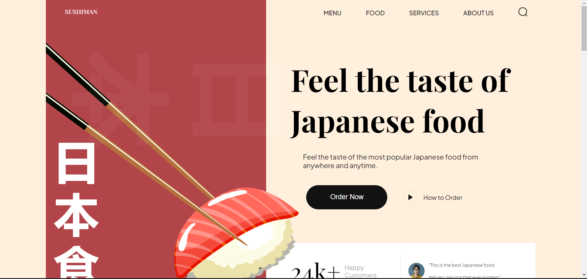
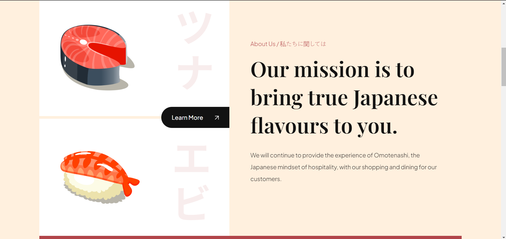
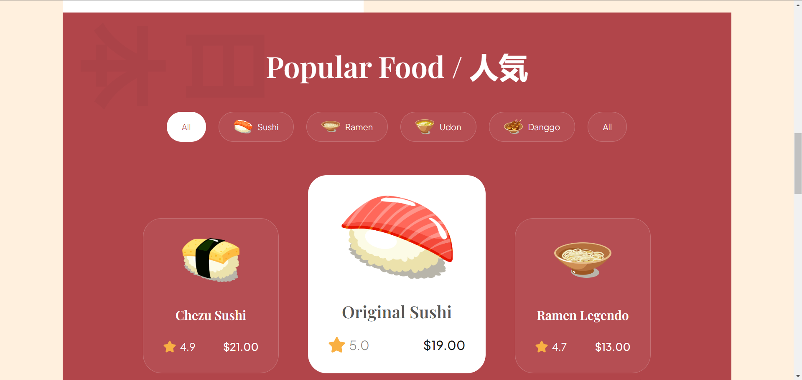

# Sushi Website

## Overview

**Sushi Website** is a simple, modern website project designed to showcase various sushi options. This project is built using HTML, CSS, and JavaScript and focuses on delivering a clean, responsive design that users can easily interact with to browse sushi items.

## Features

- Interactive sushi menu with item descriptions.
- Clean, user-friendly interface.
- Fully responsive across multiple devices and screen sizes.
- Basic dynamic functionality using JavaScript.

## Tech Stack

- **HTML**: Provides the structure for the webpage.
- **CSS**: Adds styling to make the website visually appealing.
- **JavaScript**: Used for interactivity and dynamic content updates.

## Installation

To get the project running locally on your machine, follow these steps:

1. **Clone the repository**:

   ```bash
   git clone https://github.com/sudo-parnab/Its-webtober.git
   cd Its-webtober/Sushi_Website

## View the project:


   - Open index.html file in your browser to view the Sushi Website.

## Usage
This website can serve as a portfolio for restaurants or sushi enthusiasts to showcase sushi items with details like ingredients or price. You can modify or add new sushi items, improve the styling, or implement new interactive features by editing the HTML, CSS, and JavaScript files in the respective folders.

## Screenshots :








