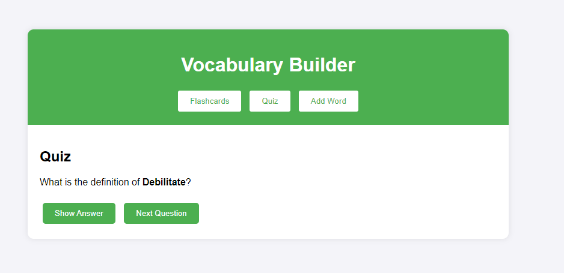

# Vocabulary Builder

## Overview
**Vocabulary Builder** is a simple web application that helps users learn new words by:
- Viewing and managing flashcards.
- Testing their knowledge through a quiz.
- Adding new words and definitions to the flashcard collection.

## Features
- **Flashcards Section**: Users can view flashcards containing a word and its definition. They can also remove cards from the collection.
- **Quiz Section**: Users are presented with a word and must guess its definition. They can view the correct answer and load new quiz questions.
- **Add Word Section**: Users can add new words and their definitions to the flashcard collection.

## How It Works
1. **Flashcards**: 
   - Flashcards display words and their definitions.
   - Users can remove a word by clicking the "Remove" button on a card.
   - Words are stored in an array of objects where each object represents a word and its definition.

2. **Quiz**:
   - A random word from the collection is presented, and the user must guess the definition.
   - The "Show Answer" button reveals the correct definition.
   - The "Next Question" button loads another random word for the quiz.

3. **Add Word**:
   - Users can submit a form to add a new word and its definition.
   - The new word is stored in the collection and can be used in both the flashcards and quiz sections.

## Sections

### Flashcards Section
- Displays all current flashcards.
- Cards are dynamically generated from the words array.
- Users can remove words from the collection by clicking "Remove" on a card.

### Quiz Section
- Displays a word, and users have to guess its definition.
- Buttons allow users to show the correct answer or load the next word.

### Add Word Section
- A form where users can input a new word and its definition.
- Submits the word to the existing collection for future use.

## Usage Instructions
1. Clone this repository.
2. Open the `index.html` file in a web browser.
3. Navigate between the three sections:
   - **Flashcards**: View all words and their definitions.
   - **Quiz**: Test your knowledge by guessing the definition of a random word.
   - **Add Word**: Add new words to the collection.

## Screenshots
### Flashcards Section

### Quiz Section

### Add Word Section

## Technologies Used
- **HTML**: Structure of the web page.
- **CSS**: Styling the web application.
- **JavaScript**: Interactivity, dynamic content loading, and form handling.

