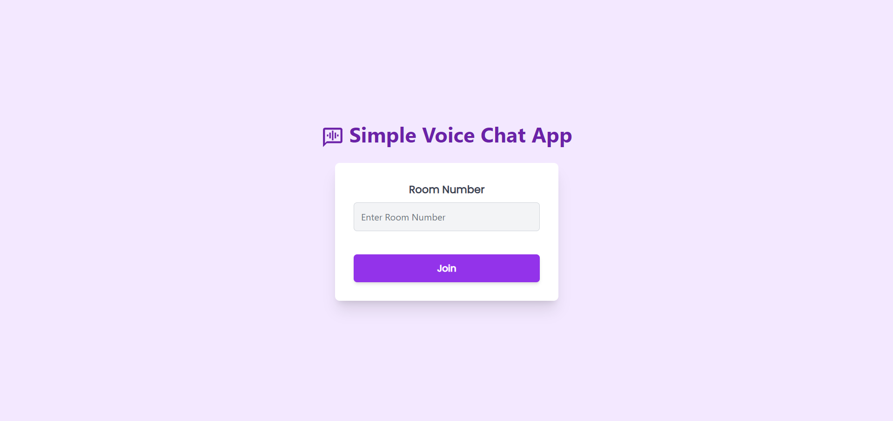

<h1 align='center'><b>💥 Voice Call App 💥</b></h1>

<!-- -------------------------------------------------------------------------------------------------------------- -->

<h3 align='center'>Tech Stack Used 🎮</h3>

<p align='center'>
   
   
   
   
   
</p>


<!-- -------------------------------------------------------------------------------------------------------------- -->

## :zap: Description 📃

<div>
   <p>This is a voice call application built with Next.js, React, and Tailwind CSS. It allows users to create and join voice call rooms with ease.</p>
</div>

<!-- -------------------------------------------------------------------------------------------------------------- -->

## :zap: How to run it? 🕹️

### Prerequisites

Ensure you have the following installed:

- Node.js
- npm or yarn

### Installation

1. Clone the repository

2. Install dependencies on both the client and server:

   ```bash
   npm install
   # or
   yarn install
   ```

### Running the Application

To start the development server and the client:

```bash
npm run dev
# or
yarn dev
```

Open [http://localhost:3000](http://localhost:3000) with your browser to see the application.

### Building for Production

To create a production build:

```bash
npm run build
# or
yarn build
```

To start the production server:

```bash
npm start
# or
yarn start
```

<!-- -------------------------------------------------------------------------------------------------------------- -->

## :zap: Screenshots 📸

<p align='center'>
   
</p>


<!-- -------------------------------------------------------------------------------------------------------------- -->

<h4 align='center'>Developed By <b><i>Sezal Lagwal</i></b> 👦</h4>
<p align='center'>
   <a href='https://www.linkedin.com/in/sezallagwal/'>
      
   </a>
   <a href='https://github.com/sezallagwal'>
      
   </a>
</p>

<h4 align='center'>Happy Coding 🧑‍💻</h4>

<h3 align="center">Show some &nbsp;❤️&nbsp; by &nbsp;🌟&nbsp; this repository!</h3>
